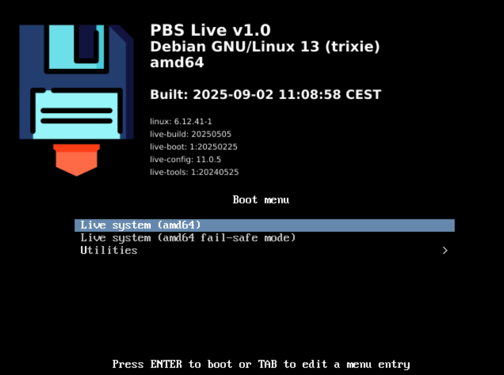

# Preparing Build Environment
## Install packages for live build

```bash
sudo apt update
sudo apt install -y live-build squashfs-tools live-boot live-config xorriso isolinux
sudo apt install -y netselect-apt
```

## Cloning the repository

```bash
git clone https://github.com/anderl1969/PBSLiveRescue
```

# Building the iso
## Quick Run

```bash
cd PBSLiveRescue

sudo lb clean
lb config
sudo lb build
```

Note:
> `lb config` will drop a **WARNING** and `sudo lb build` even an **ERROR** because of some missing secret files, which are mandatory for the additional backup scripts to work properly.
> However, for a first run it's absolutely fine to ignore these and tell `sudo lb build` to proceed anyway.
> You should end with a working ISO image with a preinstalled **Proxmox Backup Client**

## Flashing USB Thumb Drive

- After the build process finished successfully, you have the following files in your folder, among many others:
    ```bash
    -rw-r--r-- 1 root root 9,6K  2. Sep 11:13 live-image-amd64.contents
    -rw-r--r-- 1 root root 1,5M  2. Sep 11:11 live-image-amd64.files
    -rw-r--r-- 1 root root 375M  2. Sep 11:08 live-image-amd64.hybrid.iso
    -rw-r--r-- 1 root root 6,7K  2. Sep 11:11 live-image-amd64.packages
    ```

- Flash the iso-file `live-image-amd64.hybrid.iso` to an USB Thumb Drive using an appropriate tool like balenaEtcher, Rufus, ...
Be sure, the tool is capable to create a bootable thumb drive.

# Booting from USB

## Quick Run

Before you put any effort in customizing the Live Image, you should test it. **Especially if your machine(s), that you want to baremetal backup & restore with, can boot from the thumb drive.**
- Shut down your test machine.
- Insert thumb drive and power on.
- Hit the corresponding key to enter BIOS/Boot menu

If your thumb drive is not shown, you should check your BIOS settings and/or if the flashing tool is capable of creating bootable thumb drives.

- Select & confirm your thumb drive
- Grub should welcome you with the following boot screen
  
- Hit `Enter` to boot the Live Image

# Customizing

When your **Quick Run** tests succeeded, it's now time to put some effort in customizing the Live System.
First and foremost you must provide two secret files if you want to use the built in backup scripts. (see below)

You also can add some additional software if you want.

## Built in Backup-Scripts
In `config/includes.chroot_after_packages/opt/proxmoxbackupclient/` you find some usefull backup scripts you may want to use:

```bash
pbs_backup_file.sh
pbs_backup_img.sh
pbs_content.sh
pbs_dump.sh
pbs_list.sh
pbs_restore_img.sh
repository_secret.README
token_secret.README
```

## Secret Files
These scripts require two secret files to connect and authorize to the Proxmox Backup Server. Understandably, these two files are not part of the repository.
But there are two templates to get you started:

### token_secret
`config/includes.chroot_after_packages/opt/proxmoxbackupclient/token_secret`

```
aaaaaaaa-bbbb-cccc-dddd-eeeeeeeeeeee
```
Insert a valid API token of the proxmox backup server.

### repository_secret
`config/includes.chroot_after_packages/opt/proxmoxbackupclient/repository_secret`

```bash
PBS_REPOSITORY=user@pbs!token@host:store
```
For details look here:
[https://pbs.proxmox.com/docs/backup-client.html#backup-repository-locations](https://pbs.proxmox.com/docs/backup-client.html#backup-repository-locations)
